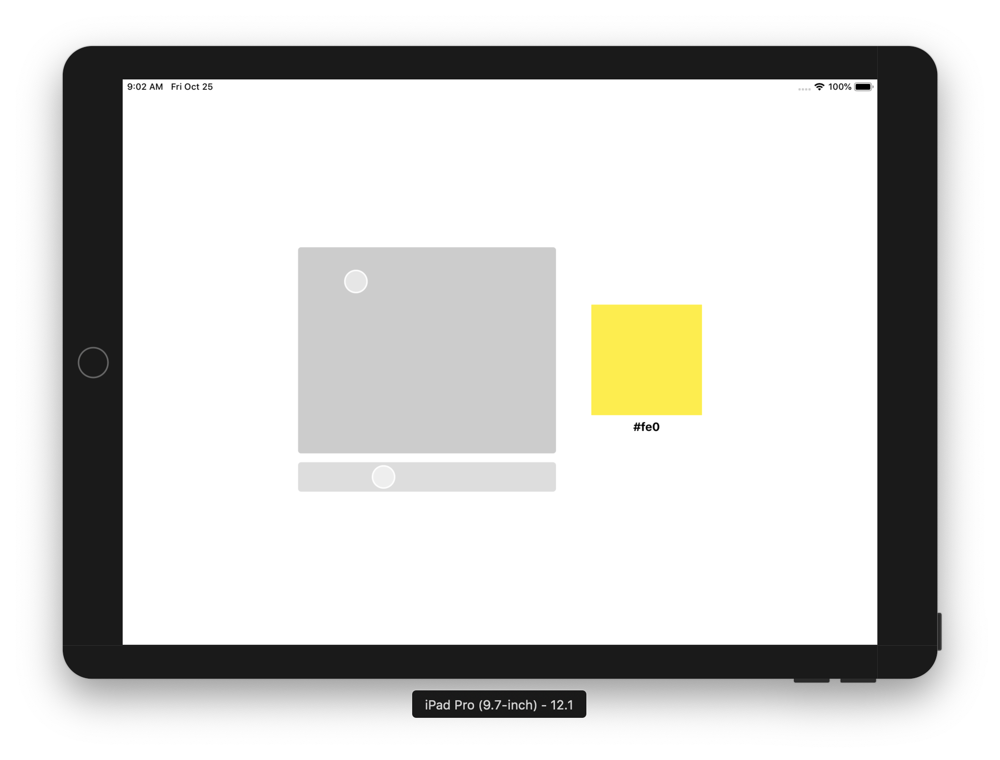

# react-native-color


---

Ce projet a été démarré avec [React Native CLI](https://facebook.github.io/react-native/docs/getting-started).

## Démarrage

Pour initialiser l'application et la lancer dans un mode de développement :

```shell
$ yarn 
$ cd ios
$ pod pod
$ cd ..
$ yarn start
```

Ensuite, ouvrez le projet iOS `/ios/ReactNativeColor.xcworkspace`, sélectionnez un iPad comme simulateur iOS, et enfin cliquez sur `Build and run`

L'application se charge alors dans le simulateur.

La page se mettra à jour si vous faites une modification du code.


## Prérequis Javascript

Pour ce test, vous êtes libre de choisir vos technos supplémentaires, comme [`react-native-svg`](https://github.com/react-native-community/react-native-svg) par exemple.

## Explication

Une fois l'appilcation lancée, vous arriverez sur cet écran :



L'objectif de ce test est de recréer un système de *color picker* pour React Native et de reproduire cette interface utilisée au sein de l'appliation Wino aujourd'hui :


Vous devez donc développer de zéro un système complet permettant de choisir une couleur au format hexadécimal en faisant varié plusieurs variables : `hue`, `saturation` et `luminosity`.

### Les plus

Une fois avoir répondu avec soin aux objectifs de base de l'exercice, vous pourrez effectuer quelques améliorations supplémentaires, quelques idées :
* améliorer le système de *gesture handler* pour le rendre plus performant
* ajouter le support pour Android
* typer le code avec `flow` ou `typescript`
* refactorer le code pour utiliser les hooks
